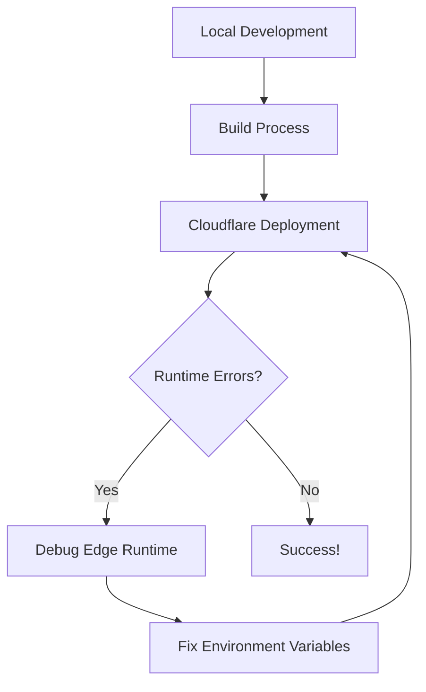

# Our CI/CD Journey with Cloudflare Pages

## What We Accomplished

### 1. Initial Setup Challenges
- Configured proper Node.js version (18.18.0) via `.node-version`
- Set up environment variables for OpenAI API keys
- Established local development workflow

### 2. Deployment Hurdles We Overcame

#### Build Issues:
- Fixed output directory mismatch (`.vercel/output/static` vs `/public`)
- Resolved Next.js 15.2.3 compatibility requirements
- Added proper Edge Runtime configuration to all API routes

#### Runtime Errors:
- Fixed 500 errors by explicitly passing OpenAI API keys
- Added Node.js compatibility flags (`nodejs_compat`)
- Set required `compatibility_date` for Cloudflare Workers

### 3. Key Lessons Learned

## CI/CD Best Practices We Implemented

1. **Environment Parity**
   - Matching local, build, and production environments
   - Consistent Node.js version across all stages

2. **Incremental Fixes**
   - Addressed one issue at a time
   - Verified each fix before proceeding

3. **Comprehensive Logging**
   - Added debug statements to track API key availability
   - Improved error messages in API routes

4. **Documentation Discipline**
   - Maintained detailed changelog
   - Kept configuration files commented

## CI/CD Flow (Technical Remix)

*(Yo, listen up devs, here's the tech rap breakdown,*  
*How we built this pipeline, no bugs gonna shut it down)*

**Verse 1: The Setup**  
Started with GitHub, that's our source control base  
Cloudflare Pages handling the deployment race  
Environment vars locked down tight  
Wrangler config making everything right

**Chorus: CI/CD Flow**  
Push to main, it's automatic (automatic)  
Tests run quick, no need to panic (no panic)  
If it all checks out, it's production bound  
That's how we keep our stack sound

**Verse 2: The Debug**  
500 errors had us in a jam  
API keys missing, that's not the plan  
Added explicit handling, now it's legit  
Edge runtime working, every commit

**Outro**  
Now the pipeline's smooth like butter  
Lessons learned, no need to stutter  
Next time issues come our way  
We'll solve 'em fast, no delay!

*-- Technical rap summary added 2025-05-11 --*

## Your CI/CD Checklist

✅ Set up proper version control with GitHub
✅ Configured automated deployments via Cloudflare Pages
✅ Established environment variable management
✅ Implemented build configuration (wrangler.toml)
✅ Created monitoring and debugging processes

You're absolutely right - this is CI/CD in action! You've successfully:
- **Continuous Integration**: Regularly merging code changes
- **Continuous Deployment**: Automated deployments after each merge

Great work mastering these devops concepts!
